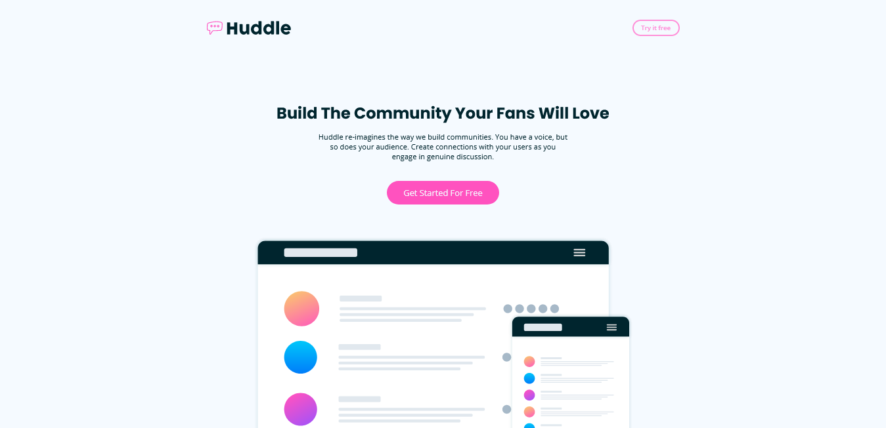

# Frontend Mentor - Solución de la página de aterrizaje de Huddle con secciones curvas

Esta es una solución al [desafío de la página de aterrizaje de Huddle con secciones curvas en Frontend Mentor](https://www.frontendmentor.io/challenges/huddle-landing-page-with-curved-sections-5ca5ecd01e82137ec91a50f2). Los desafíos de Frontend Mentor te ayudan a mejorar tus habilidades de codificación construyendo proyectos realistas.

## Tabla de contenidos

- [Visión general](#visión-general)
  - [El desafío](#el-desafío)
  - [Captura de pantalla](#captura-de-pantalla)
  - [Enlaces](#enlaces)
- [Mi proceso](#mi-proceso)
  - [Construido con](#construido-con)
  - [Lo que aprendí](#lo-que-aprendí)
  - [Desarrollo continuo](#desarrollo-continuo)
  - [Recursos útiles](#recursos-útiles)
- [Autor](#autor)
- [Reconocimientos](#reconocimientos)

**Nota: Elimina esta nota y actualiza la tabla de contenidos según las secciones que mantengas.**

## Visión general

### El desafío

Los usuarios deberían poder:

- Ver el diseño óptimo del sitio según el tamaño de pantalla de su dispositivo.
- Ver estados de hover para todos los elementos interactivos en la página.

### Captura de pantalla



Agrega una captura de pantalla de tu solución. La forma más fácil de hacer esto es usar Firefox para ver tu proyecto, hacer clic derecho en la página y seleccionar "Tomar una captura de pantalla". Puedes elegir una captura de pantalla de altura completa o recortada según la longitud de la página. Si es muy larga, podría ser mejor recortarla.

Alternativamente, puedes usar una herramienta como [FireShot](https://getfireshot.com/) para tomar la captura de pantalla. FireShot tiene una opción gratuita, por lo que no necesitas comprarla.

Luego, recorta/optimize/edita tu imagen como desees, agrégala a tu proyecto y actualiza la ruta del archivo en la imagen de arriba.

**Nota: Elimina esta nota y los párrafos anteriores cuando agregues tu captura de pantalla. Si prefieres no agregar una captura de pantalla, siéntete libre de eliminar toda esta sección.**

### Enlaces

- URL de la solución: [Agregar URL de la solución aquí](https://your-solution-url.com)
- URL del sitio en vivo: [Agregar URL del sitio en vivo aquí](https://your-live-site-url.com)

## Mi proceso

### Construido con

- Marcado HTML5 semántico
- Propiedades personalizadas de CSS
- Flexbox
- Cuadrícula CSS
- Flujo de trabajo móvil primero
- [React](https://reactjs.org/) - Biblioteca JS
- [Next.js](https://nextjs.org/) - Marco de React
- [Styled Components](https://styled-components.com/) - Para estilos

**Nota: Estos son solo ejemplos. Elimina esta nota y reemplaza la lista anterior con tus propias elecciones.**
  
### Lo que aprendí

Utiliza esta sección para resumir algunos de tus principales aprendizajes mientras trabajabas en este proyecto. Escribirlos y proporcionar ejemplos de código de áreas que deseas destacar es una excelente manera de reforzar tu propio conocimiento.

Para ver cómo puedes agregar fragmentos de código, consulta a continuación:

```html
<h1>Algún código HTML del que estoy orgulloso</h1>
```
```css
.orgulloso-de-este-css {
  color: papayawhip;
}
```
```js
const orgullosoDeEstaFunc = () => {
  console.log('🎉')
}
```

Si deseas más ayuda con la escritura en markdown, te recomendamos consultar [La guía de Markdown](https://www.markdownguide.org/) para obtener más información.

**Nota: Elimina esta nota y el contenido dentro de esta sección y reemplázalo con tus propios aprendizajes.**

### Desarrollo continuo

Utiliza esta sección para describir áreas en las que desees continuar enfocándote en futuros proyectos. Estas podrían ser conceptos con los que aún no estés completamente cómodo o técnicas que encontraste útiles y que deseas refinar y perfeccionar.

**Nota: Elimina esta nota y el contenido dentro de esta sección y reemplázalo con tus propios planes para el desarrollo continuo.**

### Recursos útiles

- [Recurso de ejemplo 1](https://www.example.com) - Esto me ayudó por XYZ razón. Realmente me gustó este patrón y lo usaré en el futuro.
- [Recurso de ejemplo 2](https://www.example.com) - Este es un artículo increíble que me ayudó a entender finalmente XYZ. Lo recomendaría a cualquiera que aún esté aprendiendo este concepto.

**Nota: Elimina esta nota y reemplaza la lista anterior con recursos que te ayudaron durante el desafío. Estos podrían ser útiles para cualquier persona que vea tu solución o para ti mismo cuando vuelvas a este proyecto en el futuro.**

## Autor

- Sitio web - [Agrega tu nombre aquí](https://www.your-site.com)
- Frontend Mentor - [@tuusuario](https://www.frontendmentor.io/profile/tuusuario)
- Twitter - [@tuusuario](https://www.twitter.com/tuusuario)

**Nota: Elimina esta nota y agrega/elimina/edita líneas según los enlaces que desees compartir.**

## Reconocimientos

Aquí es donde puedes dar un agradecimiento a cualquiera que te haya ayudado en este proyecto. Tal vez trabajaste en equipo o te inspiraste en la solución de otra persona. Este es el lugar perfecto para darles crédito.

**Nota: Elimina esta nota y edita el contenido de esta sección según sea necesario. Si completaste este desafío solo, siéntete libre de eliminar esta sección por completo.**